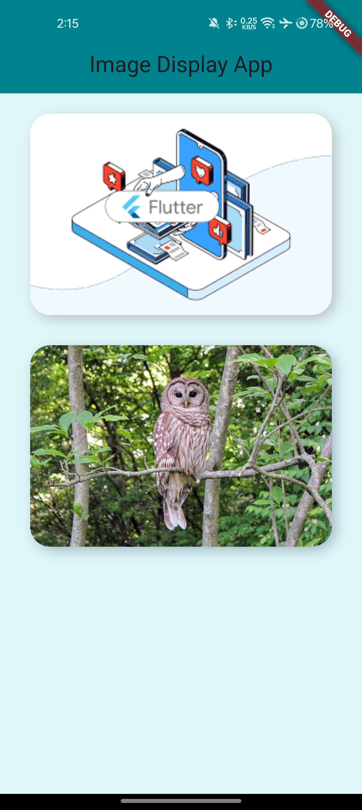

# image_display_app

This Flutter project demonstrates how to display images from both local assets and network sources, as part of **Tutedude Flutter Assignment 1**.

## Features

- ✅ Display image from local `images/flutter_learn.png`
- ✅ Display image from network using `Image.network`
- ✅ Handles loading and error states
- ✅ Includes UI enhancements: border radius & shadow
- ✅ Accepts image URL via input field

---

## 📱 Screenshot



---

## Getting Started

To run this project locally:

```bash
git clone https://github.com/yourusername/flutter-assignment-1.git
cd flutter-assignment-1
flutter pub get
flutter run
